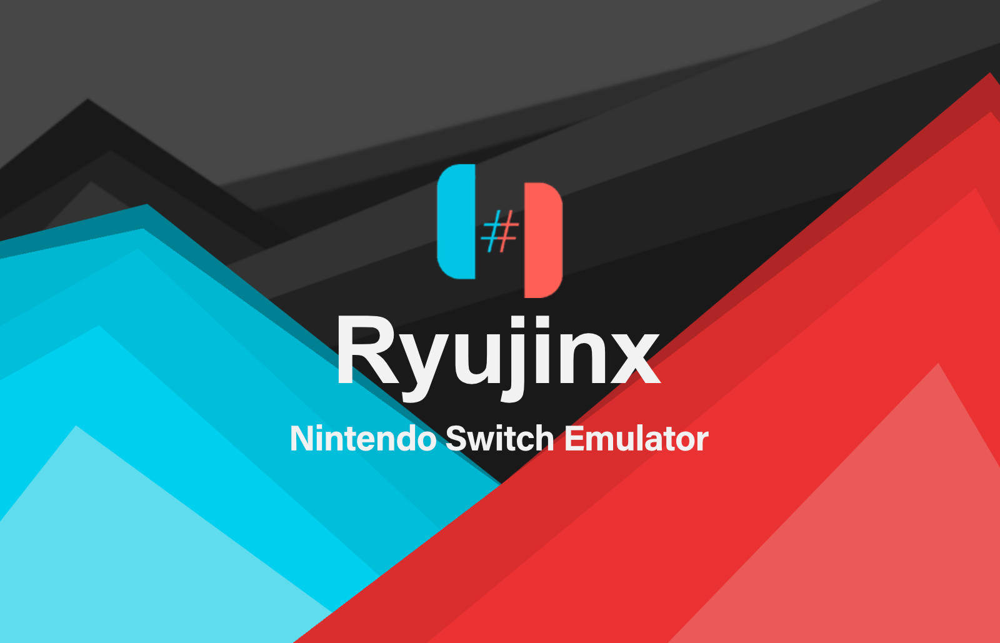
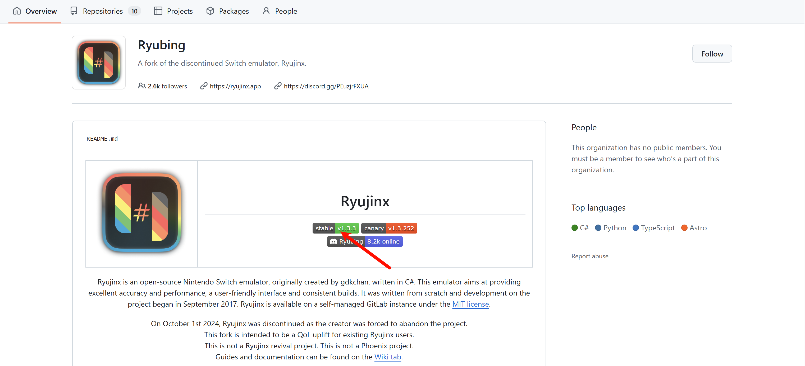
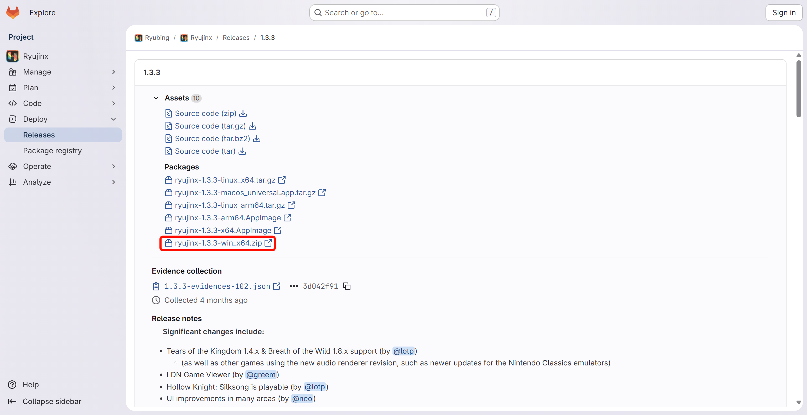
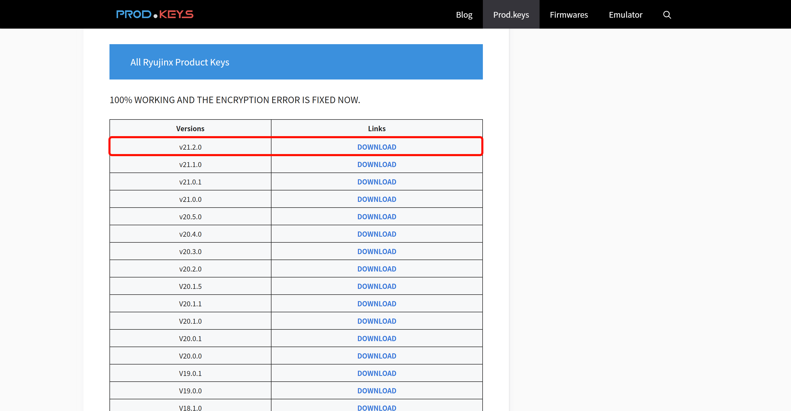
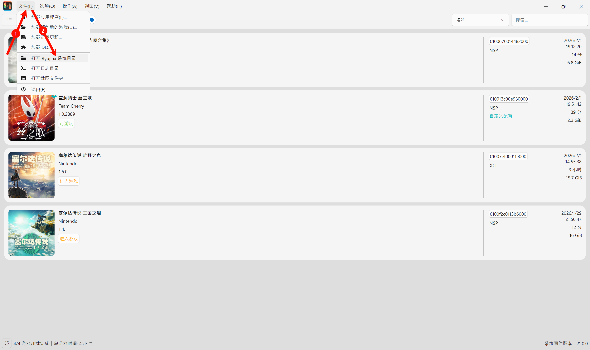
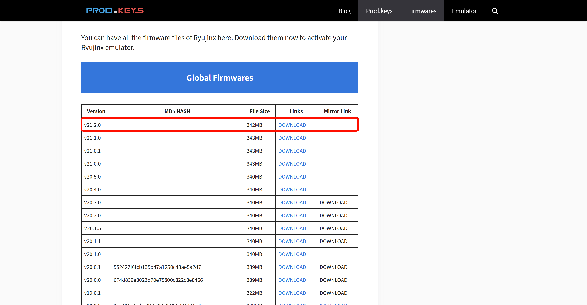
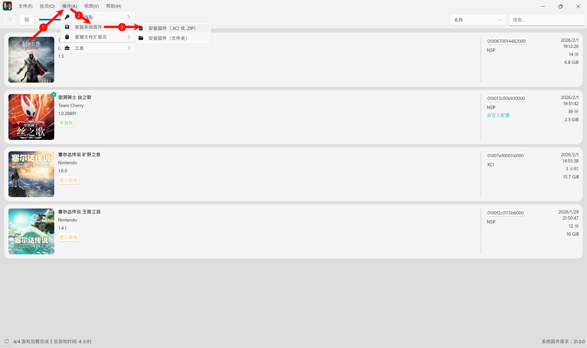
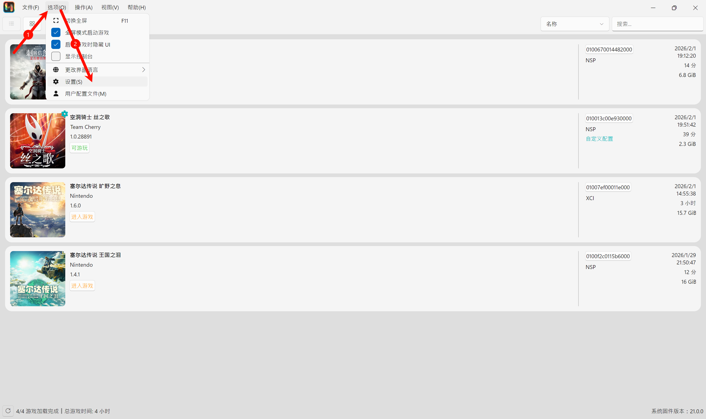
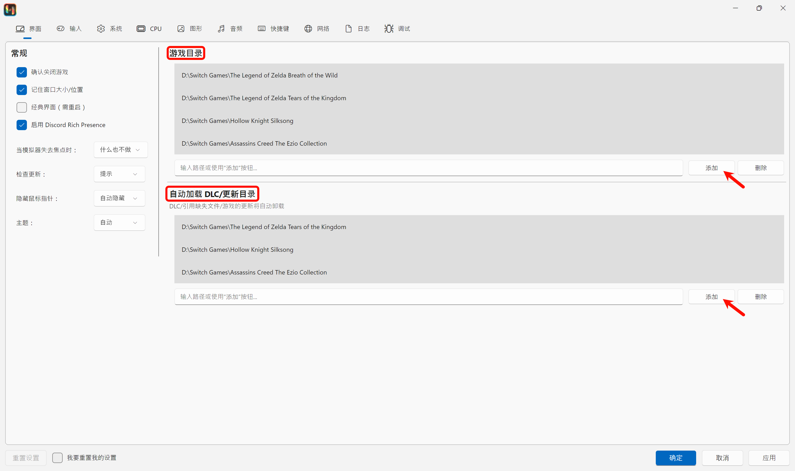

# Switch模拟器Ryujinx使用教程

任天堂Switch凭借其独特的游戏阵容和便携设计，吸引了全球无数玩家。然而，受限于主机性能或使用场景，许多玩家希望能在PC上重温《塞尔达传说：旷野之息》《异度神剑》等经典大作。Ryujinx——这款由社区驱动的开源Switch模拟器，正为这一需求提供了可能。本文将详细讲解如何使用Ryujinx模拟器游玩Switch游戏。

## Ryujinx安装

首先，我们需要安装Ryujinx。由于Ryujinx的官网已经停止运营，域名的所有权已转移至任天堂，所以只能前往社区下载。这里提供一个分支版本Ryubing，现托管在GitHub上，链接如下：https://github.com/Ryubing 。进入链接后点击stable v1.3.3即可前往下载页面，然后选择对应版本便可下载Ryujinx安装包。详细操作过程如下：

解压Ryujinx安装包后，进入publish文件夹，双击Ryujinx.exe文件即可开始安装Ryujinx模拟器。

## 安装密钥和固件

Ryujinx安装成功后最重要的就是安装密钥和固件了。

### Keys密钥

第一次启动Ryujinx会弹出一个缺少组件的错误，这时就需要安装密钥。密钥的下载地址如下（可能需要科学上网）：[https://prodkeys.net/ryujinx-prod-keys-n28/#more-18](https://link.zhihu.com/?target=https%3A//prodkeys.net/ryujinx-prod-keys-n28/%23more-18) ，直接选择最新版本下载即可。

这里还提供一个v21.2.0的密钥（提取码: tab9）：https://pan.baidu.com/s/1zJDs8BVKsPTQOMu-nlAojA

解压下载的文件后，需要将prod.keys和title.keys添加至Ryujinx的系统文件夹。首先打开Ryujinx，在上方菜单栏选择 文件-打开Ryujinx系统目录。然后进入system文件夹，放入prod.keys和title.keys文件。

最后重启Ryujinx就不会再出现错误了，这代表密钥安装成功！

### Firmware固件

密钥安装完成后就可以安装固件了。**注意：密钥和固件的安装版本必须一致！** 固件的下载地址如下（依旧需要科学上网）：https://prodkeys.net/ryujinx-firmware-v3/#more-193 ，选择与密钥对应的版本下载即可。

这里也提供一个v21.2.0的固件（提取码: 46py）：https://pan.baidu.com/s/1_a2nmG93kqbU3BSCGVlAdA

这个固件**不需要解压**，可以直接安装。首先依旧是打开Ryujinx，在上方菜单栏选择 操作-安装系统固件-安装固件（.XCI或.ZIP）。然后选中固件文件并打开，当提示是否安装固件时，点击“是”即可。

至此，密钥和系统固件就都安装完成了！下面就可以添加游戏了。

## 添加游戏及其更新

这里提供一个网站来获取Switch游戏：https://nxbrew.net/ 。通常情况下会有两种不同的游戏文件，分别是.xci和.nsp。前者包含了游戏本体和游戏更新，后者游戏本体和更新时分开的，并且需要分别下载，所以后者管理游戏更新时会更加方便。有时一些游戏文件本体会出现多个压缩包，这是分卷压缩，将所有压缩包下载后可以直接点击第一个分卷解压就可以解压出完整的游戏文件。

添加游戏只需要在Ryujinx上方菜单栏选择 选项-设置，进入设置界面。

然后在游戏目录中添加Switch游戏文件的路径。最后点击确定，即可在主界面上看到添加的游戏。如果是NSP文件类型就还需要在自动加载DLC/更新目录中添加游戏的更新文件目录，**XCI文件类型则不需要这一步**。

最后一定要检查设置里的 系统-核心-系统语言，这里**必须选择简体中文！** 不要选择中文（简体），否则可能无法加载游戏。还可以选择菜单栏里的选项，勾选全屏模式启动游戏，取消勾选显示控制台，这可以提升游玩体验和界面的美观程度。

## 结语

以上就是本篇教程的全部内容，如果完成了以上所有操作就可以在电脑上使用Ryujinx模拟器游玩Switch游戏了。关于Ryujinx模拟器的其它设置和玩法大家可以自行探索，在此就不一一介绍了。

参考资料：https://github.com/Abd-007/Switch-Emulators-Guide
